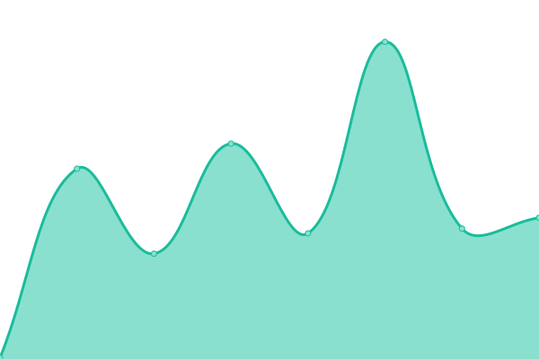

# [📈 Live Status](https://upptime.dbb.tw): <!--live status--> **🟩 All systems operational**

This repository contains the open-source uptime monitor and status page for [DBB](https://upptime.dbb.tw), powered by [Upptime](https://github.com/upptime/upptime).

With [Upptime](https://upptime.js.org), you can get your own unlimited and free uptime monitor and status page, powered entirely by a GitHub repository. We use [Issues](https://github.com/crzbread/upptime/issues) as incident reports, [Actions](https://github.com/crzbread/upptime/actions) as uptime monitors, and [Pages](https://upptime.dbb.tw) for the status page.

<!--start: status pages-->
<!-- This summary is generated by Upptime (https://github.com/upptime/upptime) -->
<!-- Do not edit this manually, your changes will be overwritten -->
<!-- prettier-ignore -->
| URL | Status | History | Response Time | Uptime |
| --- | ------ | ------- | ------------- | ------ |
|  [Blog](https://blog.dbb.tw) | 🟩 Up | [blog.yml](https://github.com/crzbread/upptime/commits/HEAD/history/blog.yml) | 

 110ms
     
 | 

<a href="https://upptime.dbb.tw/history/blog">100.00%</a>
    

|  [Tools](https://tools.dbb.tw) | 🟩 Up | [tools.yml](https://github.com/crzbread/upptime/commits/HEAD/history/tools.yml) | 

 163ms
     
 | 

<a href="https://upptime.dbb.tw/history/tools">100.00%</a>
    

|  [Docs](https://docs.dbb.tw) | 🟩 Up | [docs.yml](https://github.com/crzbread/upptime/commits/HEAD/history/docs.yml) | 

 188ms
     
 | 

<a href="https://upptime.dbb.tw/history/docs">100.00%</a>
    

<!--end: status pages-->

[**Visit our status website →**](https://upptime.dbb.tw)

## 📄 License

- Powered by: [Upptime](https://github.com/upptime/upptime)
- Code: [MIT](./LICENSE) © [Anand Chowdhary](https://anandchowdhary.com), supported by [Pabio](https://pabio.com)
- Data in the `./history` directory: [Open Database License](https://opendatacommons.org/licenses/odbl/1-0/)
